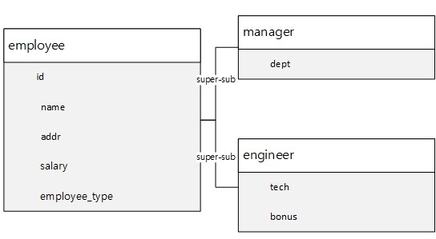

## 데이터베이스(database)

* 데이터베이스 설계는 매우 중요하다.
*  요구사항을 먼저 분석하고 데이터베이스를 설계한다.

<br>


지금까지의 과정을 통해 위와같이 계층을 분리하고, 역할과 관계를 설정했다.

계층화된 아키텍처는 다음을 특징을 가져야 한다.

* 각 계층은 독립적이다.
* 궁극적으로 한 계층의 변경이 다른 계층에 영향을 미치지 않도록 해야 한다.

하지만 위와 같은 구조로 계층을 분리해도 persistence layer와 database layer는 종속적이게 된다. Database layer를 변경하면 persistence layer도 변경해야 하기 때문이다. 이는 관계형 데이터베이스와 객체 지향 언어의 차이가 원인이므로 해결할 수 없다.

>  Hibernate등의 ORM을 사용하더라도 마찬가지다. 결국 database layer와 persistence layer는 종속적이다. ORM은 매핑 작업을 쉽게 만들어 생산성을 향상시킬 뿐이다(장황한 jdbc를 쓰지 않아도 되는 것에 의의가 있다).

따라서 __데이터베이스가 수정되지 않도록 데이터베이스를 잘 설계하여야 한다.__

<br>

### 데이터베이스 설계

1. 개념적 설계
   * Entity를 추출한다
2. 논리적 설계
   * 속성을 지정한다.
   * Entity 간의 관계를 정립한다
   * 정규화한다
3. 물리적 설계
   * 테이블을 구현한다.

지금 작성하고 있는 사원 관리 프로그램에 대하여 이를 수행한다.

<br>

1. 개념적 설계
   * 필요 엔티티는 employee 하나이다.

2. 논리적 설계

   * 다음과 같이 super-sub type 으로 설계하였다. PK 는 `id`로 결정하였다.

     

   * 각각의 column이 원자값을 가진다. 따라서 1NF 를 만족한다.
   * PK가 복합키가 아니므로 부분 함수적 충족에 대해서는 생각하지 않아도 된다. 한편, PK를 제외한 모든 속성이 PK에 함수적으로 종속된다. 따라서 2NF 를 만족한다.
   * PK 인 X 에 대하여 X → Y, Y → Z로 인해 X→Z  가 나타나는 PK가 아닌 Y, Z는 존재하지 않는다. 따라서 3NF를 만족한다.
   * 가능한 모든 함수적 종속 관계에서 결정자는 `id` 하나 뿐이다. 그리고 이는 슈퍼키이다. 따라서 BCNF를 만족한다.

3. 물리적 설계

   Super-sub type 을 물리적으로 구현하는데는 크게 세가지 방법이 있다.

   1. 테이블을 sub type의 수 만큼 완전 분할한다.

      

   2. 테이블 하나로 통합한다.

      

   3. Super type 테이블 하나와 sub type 테이블을 FK로 연결한다.

      

   속성의 수가 많지 않고, engineer 와 manager 를 한번에 다뤄야 할 경우가 많을 것으로 예상되며 열의 갯수도 크게 늘어날 것 같지 않다. 그러므로 super-sub type은 한 테이블에 통합하여 구현한다.

   

   ```sql
   CREATE TABLE `employee` (
   	`id` BIGINT(20) NOT NULL AUTO_INCREMENT,
   	`name` VARCHAR(255) NULL DEFAULT NULL,
   	`addr` VARCHAR(255) NULL DEFAULT NULL,
   	`salary` INT(11) NULL DEFAULT NULL,
   	`employee_type` VARCHAR(255) NULL DEFAULT NULL,
   	`tech` VARCHAR(255) NULL DEFAULT NULL,
   	`bonus` INT(11) NULL DEFAULT NULL,
   	`dept` VARCHAR(255) NULL DEFAULT NULL,
   	PRIMARY KEY (`id`)
   )
   ```

   

   

   