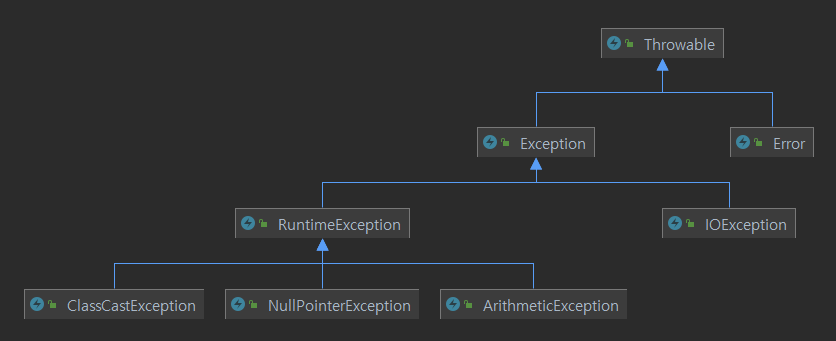

## Exception



예외는 일종의 버그다. 자바에서는 예외처리 또한 클래스로 처리한다. 계층 구조는 위와 같다.

이 중 `RuntimeException` 을 컨트롤 해야 한다.

`Error` 는 심각한 손상에 대한 클래스다. `ThreadDeath` 등의 클래스가 이를 상속하며 개발자가 예측할 수 없다.

`Exception` 중 `RuntimeException` 에 속하지 않는 `Exception` 과 그 `subclass` 들은 모두 __checked exception__ 이며 컴파일러가 인식한다. 

`RuntimeException` 과 그 하위 클래스는 모두 __unchecked exception__ 이며 컴파일러가 인식하지 못한다.

`Exception` 클래스를 상속받아 사용자 정의 예외를 정의할 수 있다.

```java
public class DuplicateUserException extends Exception{
	public DuplicateUserException(){
		this("이미 있는 회원입니다. ");
	}
	public DuplicateUserException(String message){
		super(message);
	}
}
```

>  try - catch - finallly 등의 문법은 소스코드를 참고할것


