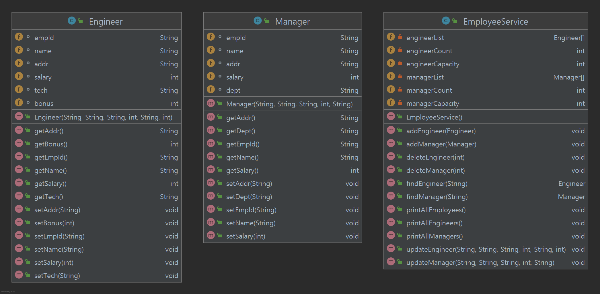
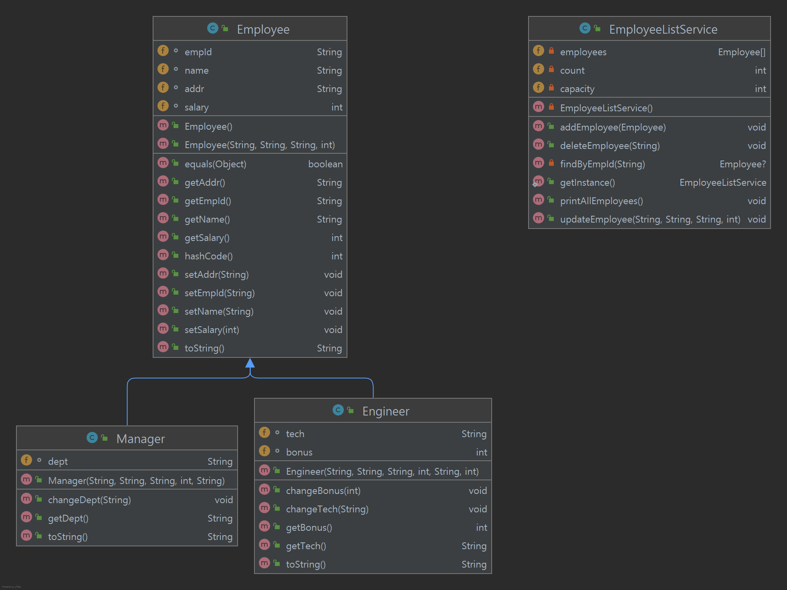

## 상속(inheritance)

* 클래스 간의 계층적 관계를 구성한다.
* 높은 코드 재활용성을 제공한다.

<br>

상속은 구현상속(implementation inheritance) 과 인터페이스 상속(interface inheritance)로 분류가능하다.

1. 구현상속(subclassing)

   순수하게 코드를 재사용하기 위한 목적으로 상속을 사용한다. 아래에서 확인할 수 있다.

   자식 클래스의 인스턴스가 부모 클래스의 인스턴스를 대체할 수 없다.

2. 인터페이스상속(subtyping)

   다형성을 위해 부모 클래스와 자식클래스가 인터페이스를 공유할 수 있도록 상속한다.

   행동이 호환되므로 자식 클래스의 인스턴스가 부모 클래스의 인스턴스를 대체할 수 있다.

<br>

사원관리를 위해 vo객체를 생성하고 이를 배열에 저장하기 위해 다음과 같은 클래스와 메서드를 작성하였다.



`Engineer` 와 `Manager` 는 모두 사원이지만 type이 다르다는 이유로 따로 취급되며 같은 메서드가 반복된다.

이를 상속을 통해 다음과 같이 변경할 수 있다.



이 과정을 통해

* 코드 재사용성을 높였으며
* 클래스 간의 계층 관계를 구성하였다.

이러한 관계가 구성되어있기 때문에 차후 새로운 형태의 직원이 생기더라도 `Employee` 클래스를 상속받아 vo 를 생성하여 처리하면 된다.

> 단순 코드 재사용을 위해서는 상속보다는 다른 객체의 인스턴스를 자신의 인스턴스 변수로 포함해서 재사용 하는 것이 낫다.

<br>

### Type casting, Virtual method invocation

다음 코드에서

 ```java
public class Animal{
    public void eat(){
        System.out.println("Animal eat");
    }
}
  
public class Cat extends{
    @Override
    public void eat(){
        System.out.println("Cat eat");
    }
  
    public void meow(){
        System.out.println("애옹");
    }
}
 ```

1. Type casting

    ```java
Cat cat = new Cat();
   Animal animal = cat;
   animal.eat();
   ```
   
   여기서 `Animal animal = cat;` 에서 암시적 __upcasting__ 이 발생했다.

   명시적으로 할 수도 있지만 컴파일러가 `Cat` 이 `Animal` 임을 알기 때문에 그러지 않아도 된다.

   한편, 아래와 같이 호출하면 컴파일러 오류가 발생한다.

    ```java
   animal.meow();
    ```
   
   animal 은 `Cat` 클래스의 인스턴스이지만 __컴파일러는 참조변수의 타입만을 인식하므로__ 오류가 발생하게된다.

   컴파일러가 이를 인식하게 하려면 다음과 같이 __downcasting__ 해야 한다. Downcasting 수행 시 실행 후 생성될 인스턴스의 타입에 유의해야한다.

    ```java
   ((Cat) animal).meow();
    ```

2.  Virtual method invocation

   컴파일 시점에는 참조변수 타입 클래스의 메서드가 호출된다.

   런타임 시점에서는 참조변수가 실제로 참조하는 인스턴스의 메서드가 호출된다(없으면 그 바로 위 부모 클래스의 메서드가 호출된다).

   따라서 위 코드들의 실행 결과는 다음과 같다.

    ```shell
   Cat eat #animal eat 이 출력되지않는다. Virtual method invocation 가 발생했다.
   애옹 #명시적 downcasting 이 일어났다.
    ```