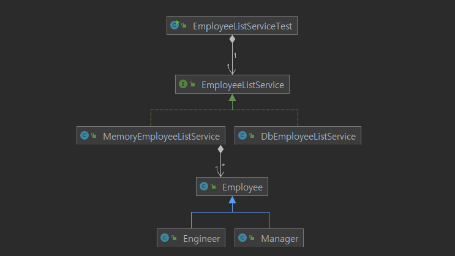
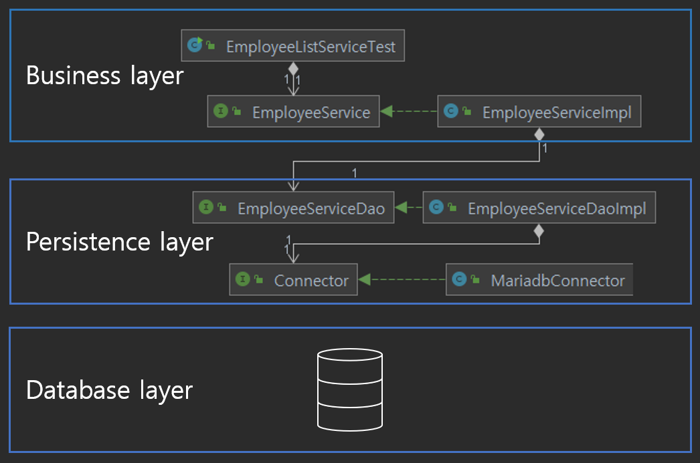

## Layered Architecture Pattern

* 유사한 코드를 한 위치에 모으고 계층으로 분리한다.
* 각 계층은 독립적이어야한다.
* 궁극적으로 한 계층의 변경이 다른 계층에 영향을 미치지 않도록 해야 한다.

 

위에 현재 프로그램의 구조를 나타내었다.

이를 다음과 같이 변경하고자 한다.

* 더이상 메모리에 값을 저장하지 않는다.
* 관계형 데이터베이스를 사용한다.

이를 위해서는 객체 지향 언어로 쓰여진 프로그램과 관계형 데이터베이스를 연결해야 한다. 

하지만 객체 지향 언어의 패러다임과 관계형 데이터베이스 패러다임 사이에는 큰 차이가 있으므로 프로그램의 코드가 난잡해질 가능성이 크다.

* RDBMS 에는 상속이 없다.

* RDBMS 에는 다형성도 없다.

* 객체나 테이블 간의 관계를 설정하는 데에 있어서도 그 목적과 방법이 다르다.

  > 객체 지향 언어 에서는 __재사용성__ 강화, 작업을 위한 필드 공유 등을 위해 객체 간에 __'has' 나 상속 관계__ 를 설정한다.
  >
  > RDBMS 에서는 __데이터 무결성__을 위해 테이블 간에 __FK__  를 설정한다.

이러한 차이가 있지만...

 

* __객체지향 언어의 특징을 반영하여 재사용성이 좋고 변경이 용이한 코드를 작성하기를 원한다.__

* __그와 동시에 관계형 데이터베이스를 도입하여 데이터 무결성, 일관성, 효율성 등을 보장받고 싶다.__

 

이를 위해 다음과 같이 __계층형 아키텍처(layered architecture)__ 를 적용하고 기존 설계를 변경하였다.

* Business layer: 비즈니스 로직을 수행하는 부분이다.

  > `EmployeeService` 클래스가 여기에 속하게 된다.

* Persistence layer: 객체 지향 언어와 관계형 데이터베이스를 연결하기 위한 부분이다. RDBMS에 엑세스 하는데 필요한 정보를 저장하고 관계형 정보와 객체형 정보를 서로 변환한다.

  >  `Connector` 는 DB 에 접근하기 위한 정보를 제공하는 __역할__ 을 수행한다.
  >
  > `EmployeeServiceDao` 는 DB에 접근하고 관계형 정보와 객체형 정보를 서로 변환하는 __역할__ 을 수행한다.

* Database layer: 관계형 정보가 저장되는 데이터베이스이다.

  > 데이터 무결성, 일관성, 효율성 등을 보장받도록 데이터베이스를 설계한다.

이제 데이터베이스만 잘 설계하면 코드 품질을 유지하면서 데이터 품질 또한 보장받게 된다.