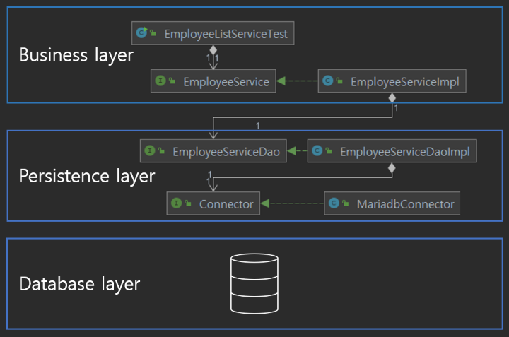

## Layered Architecture Pattern

* 유사한 코드를 한 위치에 모으고 계층으로 분리한다.
* 각 계층은 독립적이어야한다.
* 궁극적으로 한 계층의 변경이 다른 계층에 영향을 미치지 않도록 해야 한다.

 

위에 현재 프로그램의 구조를 나타내었다.

이를 다음과 같이 변경하고자 한다.

* 더이상 메모리에 값을 저장하지 않는다.
* 관계형 데이터베이스를 사용한다.

이를 위해서는 객체 지향 언어로 쓰여진 프로그램과 관계형 데이터베이스를 연결해야 한다. 

하지만 객체 지향 언어와 관계형 데이터베이스 사이에는 큰 차이가 있다.

객체 지향 언어에서는 상태와 행위를 가진 __객체__ 간의 유기적인 __상호작용__ 을 통해 문제해결을 위한 __로직__ 을 구성한다. 관계형 데이터베이스는 __정규화__ 등을 통해 데이터를 어떻게 잘 저장할지에 대해서만 생각한다.

또한, 객체 지향 프로그램은 __캡슐화, 상속, 다형성__ 등 시스템의 복잡성을 제어할 수 있는 장치를 제공하는 반면 RDBMS는 그렇지 않다.

* RDBMS 에는 상속이 없다.

* RDBMS 에는 다형성도 없다.

* 객체나 테이블 간의 관계를 설정하는 데에 있어서도 그 목적과 방법이 다르다.

  > 객체 지향 언어 에서는 __재사용성__ 강화, 작업을 위한 필드 공유 등을 위해 객체 간에 __'has' 나 상속 관계__ 를 설정한다.
  >
  > RDBMS 에서는 __데이터 무결성__ 을 위해 테이블 간에 __FK__  를 설정한다.

이러한 차이가 있지만...

 

* __객체지향 언어의 특징을 반영하여 재사용성이 좋고 변경이 용이한 코드를 작성하기를 원한다.__

* __그와 동시에 관계형 데이터베이스를 도입하여 데이터 무결성, 일관성, 효율성 등을 보장받고 싶다.__

 

이를 위해 지금까지 작성한 프로그램을 __계층형 아키텍처(layered architecture)__ 를 적용하여 분리한다. 여기서는 로직을 수행하는 부분, 데이터를 저장하는 데이터베이스 부분, java의 객체와 RDBMS의 데이터를 매핑하는부분으로 나누었다.

* Business layer: 비즈니스 로직을 수행하는 부분이다.

  > `EmployeeService` 인터페이스가 여기에 속하게 된다.

* Persistence layer: 객체 지향 언어와 관계형 데이터베이스를 연결하기 위한 부분이다. RDBMS에 엑세스 하는데 필요한 정보를 저장하고 관계형 정보와 객체형 정보를 서로 변환한다.

  >  `Connector` 는 DB 에 접근하기 위한 정보를 제공하는 __역할__ 을 수행한다.
  >
  > `EmployeeServiceDao` 는 DB에 접근하고 관계형 정보와 객체형 정보를 서로 변환하는 __역할__ 을 수행한다.

* Database layer: 관계형 정보가 저장되는 데이터베이스이다.

  > 데이터 무결성, 일관성, 효율성 등을 보장받도록 데이터베이스를 설계한다.

 

### DTO, VO, Entity

> https://tecoble.techcourse.co.kr/post/2021-05-16-dto-vs-vo-vs-entity/
>
> 를 참고하였다.

* DTO(Data Transfer Object)

  >  계층 간 데이터를 전달하기 위한 객체

  불변 객체로 활용하기 위해 생성자를 이용하여 초기화한다.

  가변 객체로 활용하기 위해서는 setter 로 초기화한다.

* VO(Value Object)

  > 값 자체를 표현하는 객체

  객체들의 주소가 달라도 값이 같으면 동일하다(`equals()` 와 `hashcode()` 를 오버라이딩 해야한다).

* Entity

  > 실제 DB 테이블과 매핑되는 핵심 클래스

  요청이나 응답값을 전달하는 클래스로 사용하면 안된다.

  setter 를 가지면 가변 객체로 활용할 수 있다.

  

