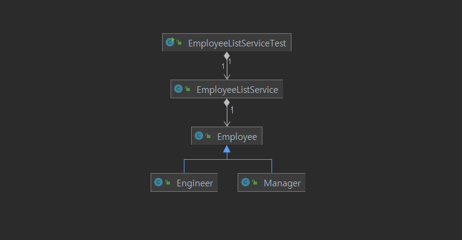
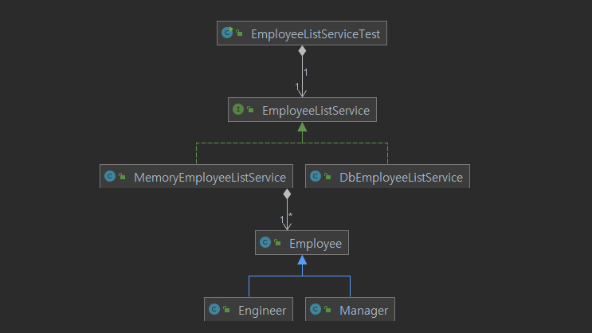

## 다형성(polymorphism)

* 역할과 구현을 분리한다.
* 인터페이스를 구현한 객체 인스턴스를 실행 시점에 유연하게 변경할 수 있다.
* 따라서 __인터페이스를 안정적으로 잘 설계하여야 한다.__

<br>



현재 프로그램의 구조는 위와 같다.
이를 `EmployeeListService` 를 사용하는 클래스는 다음과 같다.

```java
public class EmployeeListServiceTest{
    EmployeeListService service = EmployeeListService.getInstance();
    
    public void employeeTest(){
        Manager m1 = new Manager("111", "manager1", "addr1", 500, "dept1");
        Manager m2 = new Manager("222", "manager2","addr2",400,"dept2");

        service.addEmployee(m1);
        service.addEmployee(m2);
        /*
        * 이하 생략
        */
    }
}
```

<br>

### 데이터 주도 설계의 한계

여기까지의 프로그램은 __'객체가 포함하는 데이터가 무엇인가'__ 에 집중해서 설계되었다. 설계 시작부터 데이터에 관해 결정해야 했고, 내부 __구현을 이른 시기에 하게 된다__.

> vo 와 Service 클래스의 필드를 먼저 정의하면서 프로그램을 작성해 왔고 내부 구현도 비슷한 시점에 이루어졌다.

그러나 이러한 관점에서 설계를 계속 하게 된다면 객체를 단순한 데이터 집합체로만 간주하게되며 getter, setter 가 과도하게 사용된다. 그리고 getter, setter 는 public 속성과 큰 차이가 없으므로 객체의 캡슐화는 무너진다.

또한 객체를 먼저 구현한 상태에서 다른 객체와의 협력 방법을 고민하므로...

* 이미 구현된 객체의 인터페이스를 억지로 끼워맞추게 되고

* 내부 구현이 객체의 인터페이스를 어지럽히며

* 응집도와 결합도에 나쁜 영향을 미쳐 변경에 취약한 코드가 만들어질 가능성이 크다.

### 응집도

> 한 모듈 내부의 처리 요소가 서로 관련되어 있는 정도
>
> 응집도가 높게 설계되어야 한다.

향상시키기 위해...

1. 구현이 변경된다면, 변경되어야 하는 이유에 따라 클래스를 분리한다.

   * 서로 연관성이 없는 기능이나 데이터가 하나의 클래스 안에 뭉쳐 있으면 응집도가 낮다.

   * 클래스의 각각의 요소에 대한 변경의 이유가 하나로 통일되지 않는다면 응집도가 낮다.

     > 지금까지 작성한 사원 관리 프로그램의 Service 클래스의 경우에는 데이터를 저장하는 자료 구조가 변경될때 메서드와 필드가 모두 변경되어야한다. 다른 이유로 일부의 메서드만 변경되는 경우는 없다. 또한 클래스의 메서드와 필드는 모두 '저장된 사원 정보' 에 대하여 CRUD를 수행하기 위한 것이므로 연관성이 높다. 따라서 이 부분에서는 응집도가 높다고 볼 수 있다.

2. 필드가 초기화 되는 시점에 따라 클래스를 분리한다.

   * 클래스의 속성이 서로 다른 시점에 초기화되거나 일부만 초기화되면 응집도가 낮다.

   * 인스턴스를 생성할 때 모든 속성을 함께 초기화 하는 것이 응집도가 높은 것이다.

     > Service 클래스의 필드는 데이터를 저장하는 배열 하나 뿐이고 이는 객체가 생성될 때 초기화된다.

3. 메서드가 접근하는 필드를 기준으로 클래스를 분리한다.

   * 모든 메서드가 객체의 속성을 사용한다면 응집도가 높다.

   * 메서드들이 사용하는 속성에 따라 그룹이 나뉜다면 클래스의 응집도가 낮다.

     > Service 클래스의 모든 메서드는 저장된 데이터에 대해 CRUD를 수행하기 위해 모든 속성을 사용한다.
     >
     > _지금까지 작성한 Service 클래스에 대해서는 응집도가 높게 잘 설계된 것으로 보인다_

### 책임 주도 설계

__특징__

1. 데이터보다 행동을 먼저 결정한다.

   * 객체가 수행해야 하는 책임은 무엇인지 결정한다.

   * 그 후에 이를 위해 필요한 데이터가 무엇인지 결정한다.

2. 협력이라는 문맥에서 책임을 결정한다.

   * 책임은 협력에 적합해야한다. 
   * 협력을 시작하는 주체는 메세지 전송자이고 메시지를 먼저 결정하므로 메시지 전송자는 수신자에 대한 어떠한 가정도 할 수 없다.

__방법__

1. 시스템이 사용자에게 제공해야 하는 기능(시스템 책임)을 파악한다.
2. 시스템 책임을 더 작은 책임으로 분할한다.
3. 분할된 책임을 수행할 수 있는 적절한 객체 또는 역할을 찾아 책임을 할당한다.
4. 객체가 책임을 수행하는 도중 다른 객체의 도움이 필요한 경우 이를 책임질 적절한 객체 또는 역할을 찾는다.
5. 해당 객체 또는 역할에게 책임을 할당함으로써 두 객체가 협력하게 한다.

<br>

### 재설계



* 요구 사항
  * 시스템이 사용자에게 제공해야 하는 기능은 사원관리 기능이다.
  * 사원관리를 위한 CRUD 기능을 제공해야 한다.
  * 메모리에 데이터를 저장해서 테스트를 하고, 추후 데이터베이스와 연동해야한다.

처음의 설계에서는 객체가 포함하는 __데이터__ 에 집중했기 때문에 `EmployeeService` 클래스를 `EmployeeListServiceTest` 클래스에서 참조형 타입으로 직접 사용했다. 

하지만 추후 데이터베이스와 연동하게 된다면 데이터가 바뀌게 된다. 그렇다면 인 메모리 데이터에 집중한 기존 설계를 적용하기에는 무리가 있을 것이다.

이제 이를 `EmployeeListService` 라는 __책임(역할)__ 을 수행하는 __인터페이스__ 로 교체한다.

```java
public class EmployeeListServiceTest{
    private static EmployeeListService service = EmployeeListService.getInstance();
    
    public void employeeTest(){
        Manager m1 = new Manager("111", "manager1", "addr1", 500, "dept1");
        Manager m2 = new Manager("222", "manager2","addr2",400,"dept2");

        service.addEmployee(m1);
        service.addEmployee(m2);    
        /*
        * 이하 생략
        */
    }
}
```

그러면 `EmployeeListServiceTest` 입장에서 `MemoryEmployeeListService` 와 `DbEmployeeListService` 는 __동일한 역할을 수행하므로 차이가 없다__.

즉, `addEmployee` 등의 메시지(메서드)만 이해할 수 있으면 __인스턴스의 타입은 상관이 없게 되며, 역할(인터페이스)을 통해 다형적으로 협력할 수 있게 되었다__. 


